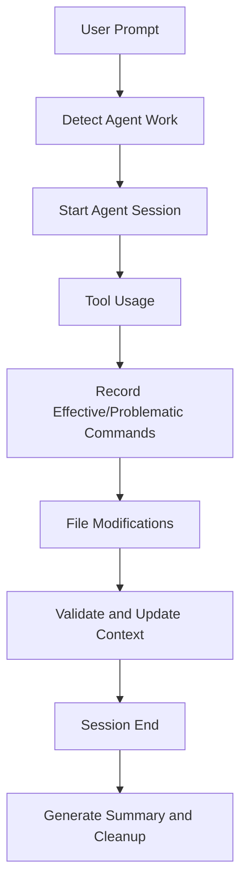

# Claude Code Hooks System

This directory contains hooks that automatically integrate with the agent context management system, providing seamless development workflow automation.

## Available Hooks

### 🚀 **user-prompt-submit-hook**
**Triggers**: When you submit any message to Claude Code
**Purpose**: Automatic agent session management and task detection

**Features**:
- Detects agent commands (`@test-comprehensive`, `@feature-complete`, etc.)
- Automatically starts agent sessions with task context
- Provides development environment hints and warnings
- Logs all user interactions for analysis

**Example Output**:
```
🤖 Detected agent work: web-testing-specialist
📋 Task: implement visual regression testing
✅ Started session for web-testing-specialist
```

### 🔧 **post-tool-call-hook**  
**Triggers**: After any tool is executed (Bash, Edit, Read, etc.)
**Purpose**: Automatic context learning from tool usage

**Features**:
- Records effective and problematic commands automatically
- Tracks agent-specific patterns and performance metrics
- Updates agent context with discoveries and insights
- Cross-agent dependency tracking

**Example Output**:
```
✅ Recorded effective command for web-testing-specialist: playwright test --ui
🔗 Recording testing dependency for react-convex-builder
📊 Performance data available for Bash
```

### 🛡️ **pre-edit-hook**
**Triggers**: Before any file is modified
**Purpose**: Quality gates and validation before changes

**Features**:
- Protects critical files (package.json, schema.ts)
- Validates file types and project structure
- Agent-specific file validation
- Context updates for upcoming changes

**Example Output**:
```
🔍 Pre-edit validation for: src/components/TaskCard.tsx
⚛️  React component file detected
📝 Modifying existing React component
✅ Pre-edit validation completed
```

### ✅ **post-edit-hook**
**Triggers**: After any file modification
**Purpose**: Validation and context updates after changes

**Features**:
- TypeScript compilation validation
- React component pattern checking  
- Convex function validation
- Quality checks (ESLint, Prettier)
- Agent context updates with results

**Example Output**:
```
✅ Post-edit validation for: convex/tasks.ts
🔄 Convex function modified
✅ Convex function exports detected
🔄 Convex dev server detected - functions should reload automatically
```

### 👋 **session-end-hook**
**Triggers**: When Claude Code session terminates
**Purpose**: Session cleanup and summary generation

**Features**:
- Ends active agent sessions properly
- Generates session summaries with metrics
- Final project health check
- Development insights and next step suggestions
- Log rotation and cleanup

**Example Output**:
```
🤖 Ending session for agent: web-testing-specialist
📊 Generating session summary
✅ Session summary added to context
🏥 Running final project health check
✅ Project appears to be in good health
```

## Integration with Agent Context System

### Automatic Context Updates
The hooks automatically maintain agent context without manual intervention:



### Context Files Updated Automatically
- **current-state.md**: Updated with session activities
- **work-history.md**: Session summaries and accomplishments  
- **commands-effective.md**: Successful commands discovered during work
- **commands-problematic.md**: Failed commands and issues encountered
- **todo-future.md**: Next steps identified during development

### Agent Intelligence Enhancement
Each hook contributes to agent learning:

1. **Pattern Recognition**: Successful workflows become reusable patterns
2. **Error Prevention**: Problematic approaches are avoided in future sessions
3. **Context Awareness**: Agents understand project-specific constraints
4. **Quality Assurance**: Automatic validation prevents regressions

## Hook Execution Flow

### Session Lifecycle
```bash
# 1. User starts work
User: "@test-comprehensive visual regression testing"
→ user-prompt-submit-hook: Detects testing work, starts session

# 2. Agent works with tools  
Agent uses Bash tool: "playwright test --ui"
→ post-tool-call-hook: Records effective command

# 3. Agent modifies files
Agent edits: "tests/visual-regression.spec.ts"
→ pre-edit-hook: Validates test file structure
→ post-edit-hook: Checks test patterns, updates context

# 4. Session ends
Claude Code session terminates
→ session-end-hook: Generates summary, suggests next steps
```

### Quality Gates
The hooks implement several quality gates:

- **TypeScript Validation**: Ensures code compiles after changes
- **JSON Validation**: Prevents invalid configuration files  
- **Convex Integration**: Validates backend function patterns
- **React Patterns**: Checks component structure and exports
- **Test Structure**: Ensures proper test organization

## Configuration and Customization

### Log Files
The hooks create several log files for tracking:

- `.claude/session.log`: User prompts and session events
- `.claude/tool-usage.log`: All tool executions with timestamps
- `.claude/edit-log.txt`: File modification history
- `.claude/insights.md`: Development patterns and insights

### Temporary Files
Session state is tracked with temporary files:

- `.claude/current-agent`: Currently active agent
- `.claude/current-task`: Current task description

### Customization
Hooks can be customized by editing the shell scripts:

```bash
# Add custom agent detection patterns
if [[ "$prompt" =~ "my-custom-pattern" ]]; then
    echo "my-custom-agent"
fi

# Add custom validation rules  
if [[ "$file_path" =~ "my-special-files" ]]; then
    echo "Custom validation for special files"
fi
```

## Benefits

### For Agents
- **Continuous Learning**: Each session improves future performance
- **Context Awareness**: Understanding of project-specific patterns
- **Quality Assurance**: Automatic validation prevents issues
- **Efficiency**: Reuse of proven approaches

### For Developers  
- **Transparency**: Clear visibility into agent decision-making
- **Quality**: Automatic validation and quality checks
- **Insights**: Development patterns and productivity metrics
- **Reliability**: Consistent approach across sessions

### For Project
- **Knowledge Retention**: Learning persists across sessions
- **Quality Maintenance**: Consistent code standards
- **Process Improvement**: Optimization based on usage patterns
- **Documentation**: Automatic capture of development decisions

This hooks system transforms the agent context management from manual updates to a fully automated, intelligent learning system that continuously improves development workflows.